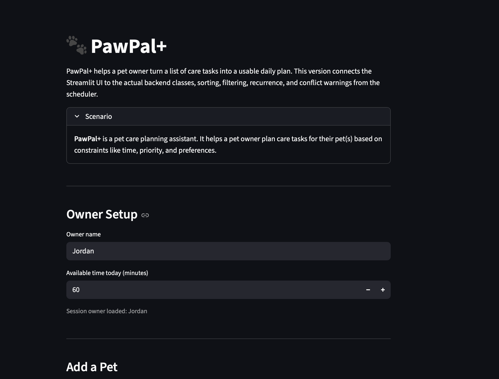

# PawPal+ (Module 2 Project)

PawPal+ is a Streamlit pet care planner that helps a busy owner organize tasks for one or more pets. It combines an object-oriented Python backend with a simple UI so an owner can track care work, build a daily plan, and see lightweight scheduling warnings.

## Features

- Owner, pet, and task management backed by Python classes instead of UI-only state.
- Sorting by due time so schedules appear in chronological order.
- Filtering by pet and completion status to review the task list more easily.
- Daily and weekly recurrence so repeated care tasks generate the next occurrence automatically.
- Conflict warnings when multiple tasks are scheduled for the exact same time.
- Time-limited schedule generation that selects tasks based on priority and available minutes.
- CLI demo and automated tests for core scheduler behavior.

## Smarter Scheduling

PawPal+ includes a few lightweight scheduling features beyond basic task storage:

- Tasks can be sorted by due time so the plan reads in a more natural daily order.
- Tasks can be filtered by completion status or by pet name to make review easier.
- Daily and weekly recurring tasks automatically generate the next occurrence when completed.
- The scheduler can detect exact same-time conflicts and return warning messages instead of failing.

## 📸 Demo

```html
<a href="/course_images/ai110/your_screenshot_name.png" target="_blank"></a>
```

## Testing PawPal+

Run the automated tests with:

```bash
python -m pytest
```

The current test suite covers task completion, adding tasks to pets, chronological sorting, recurring daily tasks, and exact-time conflict detection.

Confidence Level: 4/5 stars. The core behaviors are working and covered by tests, but there is still room to add cases for weekly recurrence, invalid time inputs, and overlap detection based on duration.

## Getting Started

### Setup

```bash
python -m venv .venv
source .venv/bin/activate  # Windows: .venv\Scripts\activate
pip install -r requirements.txt
```

### Run the app

```bash
streamlit run app.py
```

If `streamlit` is not on your path, use:

```bash
python -m streamlit run app.py
```

### Suggested workflow

1. Read the scenario carefully and identify requirements and edge cases.
2. Draft a UML diagram with classes, attributes, methods, and relationships.
3. Convert the UML into Python class stubs.
4. Implement scheduling logic in small increments.
5. Add tests to verify key behaviors.
6. Connect the logic to the Streamlit UI in `app.py`.
7. Refine the UML and documentation so they match the final implementation.
