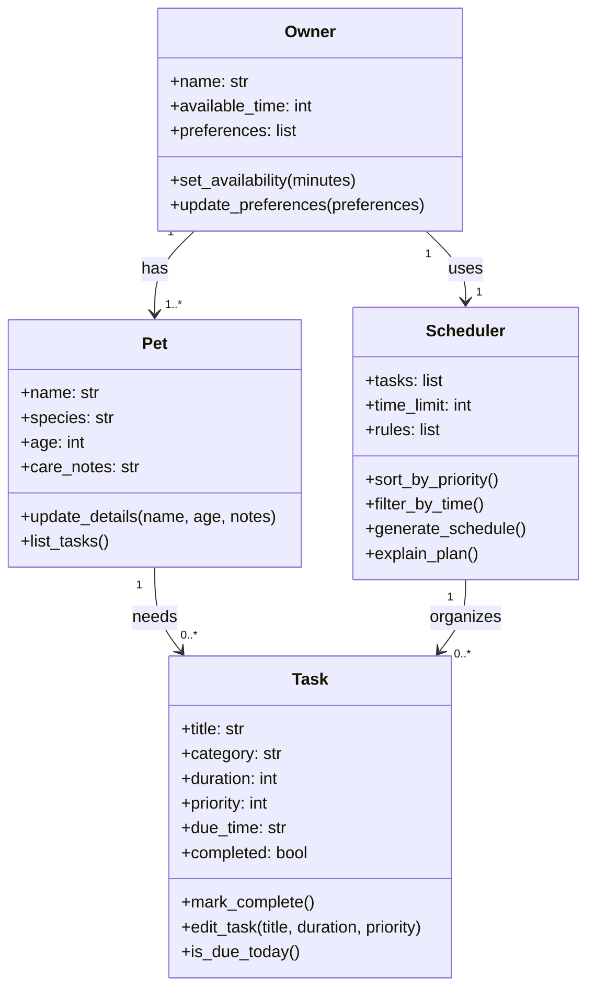

# PawPal+ Project Reflection

## 1. System Design

**a. Initial design**

- One core action is that a user should be able to enter basic information about themselves, their pet, and any care preferences so the system has the context it needs to make decisions.
- A second core action is that a user should be able to add, edit, and organize pet care tasks such as feedings, walks, medications, grooming, and enrichment activities.
- A third core action is that a user should be able to view a daily schedule that prioritizes the most important tasks based on available time, task priority, and owner preferences.
- The main objects in my initial design were `Owner`, `Pet`, `Task`, and `Scheduler`.
- `Owner` would store attributes such as name, available time, and care preferences. Its methods could include updating preferences and setting daily availability.
- `Pet` would store attributes such as name, species, age, and notes about care needs. Its methods could include updating pet details and listing the pet's tasks.
- `Task` would store attributes such as title, category, duration, priority, due time, and completion status. Its methods could include marking a task complete, editing task details, and checking whether the task should be included in today's plan.
- `Scheduler` would store the available tasks, owner constraints, and scheduling rules. Its methods could include sorting tasks by priority, filtering tasks that fit the time limit, and generating the final daily schedule.

- I kept the relationships simple so they match the app requirements: an owner can have pets, pets can have care tasks, and the scheduler organizes tasks into a daily plan.
- I treated the daily schedule as the output produced by the `Scheduler` instead of making it a separate class in the UML.

**b. Design changes**

- Did your design change during implementation?
- If yes, describe at least one change and why you made it.

---

## 2. Scheduling Logic and Tradeoffs

**a. Constraints and priorities**

- What constraints does your scheduler consider (for example: time, priority, preferences)?
- How did you decide which constraints mattered most?

**b. Tradeoffs**

- Describe one tradeoff your scheduler makes.
- Why is that tradeoff reasonable for this scenario?

---

## 3. AI Collaboration

**a. How you used AI**

- How did you use AI tools during this project (for example: design brainstorming, debugging, refactoring)?
- What kinds of prompts or questions were most helpful?

**b. Judgment and verification**

- Describe one moment where you did not accept an AI suggestion as-is.
- How did you evaluate or verify what the AI suggested?

---

## 4. Testing and Verification

**a. What you tested**

- What behaviors did you test?
- Why were these tests important?

**b. Confidence**

- How confident are you that your scheduler works correctly?
- What edge cases would you test next if you had more time?

---

## 5. Reflection

**a. What went well**

- What part of this project are you most satisfied with?

**b. What you would improve**

- If you had another iteration, what would you improve or redesign?

**c. Key takeaway**

- What is one important thing you learned about designing systems or working with AI on this project?
