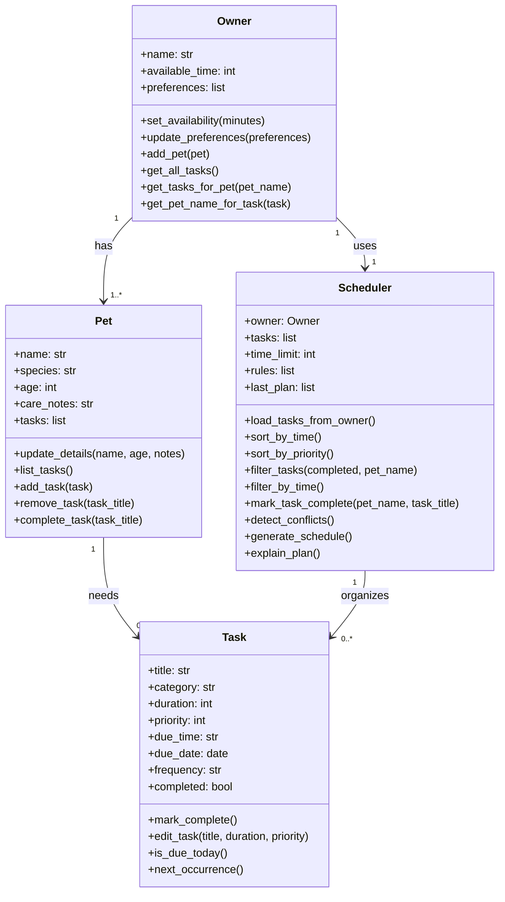

# PawPal+ Project Reflection

## 1. System Design

**a. Initial design**

- My initial design focused on four main classes: `Owner`, `Pet`, `Task`, and `Scheduler`. I chose these classes because they match the main responsibilities of the app: storing owner information, storing pet information, representing care tasks, and generating a daily plan.
- The `Owner` class is responsible for storing the owner's name, available time, preferences, and pet list. It also handles updates to availability and preferences so the scheduler has the right constraints to work with.
- The `Pet` class is responsible for storing information about each pet, including its name, species, age, care notes, and assigned tasks. It also provides methods for updating pet details and viewing that pet's tasks.
- The `Task` class is responsible for representing individual care activities such as walks, feedings, or medications. It stores important scheduling details like category, duration, priority, due time, and completion status, and it supports actions such as editing the task, marking it complete, and checking whether it belongs in today's schedule.
- The `Scheduler` class is responsible for organizing tasks into a daily plan. It uses owner constraints and task information to sort tasks by priority, filter tasks that fit within the available time, and generate an explanation for the final plan.

- I kept the relationships simple so they match the app requirements: an owner can have pets, pets can have care tasks, and the scheduler organizes tasks into a daily plan.
- I treated the daily schedule as the output produced by the `Scheduler` instead of making it a separate class in the UML.

**b. Design changes**

- Yes. After reviewing the class skeleton, I updated the `Scheduler` design so it can hold a reference to an `Owner` and load tasks from that owner's pets.
- I made this change because the earlier version treated tasks as a separate input list, which could duplicate data already stored inside each `Pet`. Linking the scheduler more directly to the owner-pet-task relationship makes the design cleaner and should make the scheduling logic easier to manage later.

---

## 2. Scheduling Logic and Tradeoffs

**a. Constraints and priorities**

- My scheduler considers available time, task priority, completion status, due time, due date, and whether a task belongs to a selected pet when filtering. It also checks for simple time conflicts when multiple tasks share the same due time.
- I treated available time and task priority as the most important constraints because the app needs to choose a realistic plan first. After that, I used due time to present the selected tasks in a natural chronological order so the final schedule is easier for a pet owner to follow.

**b. Tradeoffs**

- One tradeoff my scheduler makes is that its conflict detection only checks for exact time matches instead of calculating full time overlaps based on task duration.
- That tradeoff is reasonable for this version of PawPal+ because it keeps the logic lightweight and easy to understand while still catching a common scheduling problem. A more advanced overlap algorithm would be more accurate, but it would also add complexity that was not necessary for the first working version.

---

## 3. AI Collaboration

**a. How you used AI**

- I used AI mostly for design brainstorming, turning requirements into class structures, and checking how to translate ideas like recurrence or conflict detection into smaller methods. It was also useful for suggesting test cases and for pressure-testing whether a method signature still matched the design.
- The Copilot features that were most effective were chat-based design brainstorming, inline suggestions for method structure, and test generation prompts for targeted behaviors like recurrence and conflict detection.
- The most helpful prompts were focused and specific, such as asking how a scheduler should retrieve tasks from an owner's pets, how to sort tasks by time with a lambda key, or what edge cases matter for recurring tasks and conflict warnings.

**b. Judgment and verification**

- One moment where I did not accept an AI suggestion as-is was around keeping tasks as a separate list on the scheduler without leaning on the owner-pet relationship. I changed that design so the scheduler loads tasks from the owner's pets instead, because that kept the system model more consistent and avoided duplicated sources of truth.
- I also preferred not to over-optimize some algorithms when the more compact AI suggestion was harder to read. If a version was more Pythonic but less clear for a future student or reviewer, I kept the clearer one.
- Using separate chat sessions for design, implementation, algorithms, and testing helped me stay organized because each phase had a different goal and different questions. That separation reduced context drift and made it easier to judge whether an AI suggestion actually fit the current stage of the project.
- I evaluated AI suggestions by checking whether they matched my existing class responsibilities, then verifying them with a CLI demo and pytest. If a suggestion made the code more clever but harder to understand, I kept the version that was easier to maintain.

---

## 4. Testing and Verification

**a. What you tested**

- I tested task completion, adding tasks to pets, sorting tasks by time, generating the next occurrence for a recurring daily task, and detecting exact same-time conflicts.
- These tests were important because they covered both the basic class behaviors and the "smart" scheduling features that make PawPal+ different from a simple task list.

**b. Confidence**

- I am quite confident in the scheduler because the core logic passes automated tests and I also verified it through the CLI demo and Streamlit UI. I would rate my confidence at about 4 out of 5.
- If I had more time, I would test weekly recurrence more thoroughly, tasks with invalid or missing time formats, multiple recurring tasks completed in sequence, and more advanced overlap detection based on start time plus duration.

---

## 5. Reflection

**a. What went well**

- I am most satisfied with how the project stayed modular from the beginning. The UML, backend classes, CLI demo, tests, and Streamlit app all built on the same design instead of becoming separate one-off solutions.

**b. What you would improve**

- In another iteration, I would improve the scheduling algorithm so it considers overlapping durations instead of only exact time matches, and I would make the UI better at editing or deleting existing pets and tasks.

**c. Key takeaway**

- One important thing I learned is that AI is most useful when I stay in the lead architect role. It can generate options quickly, but I still need to decide what belongs in the design, verify the behavior, and keep the system simple enough for a human to understand and extend.
