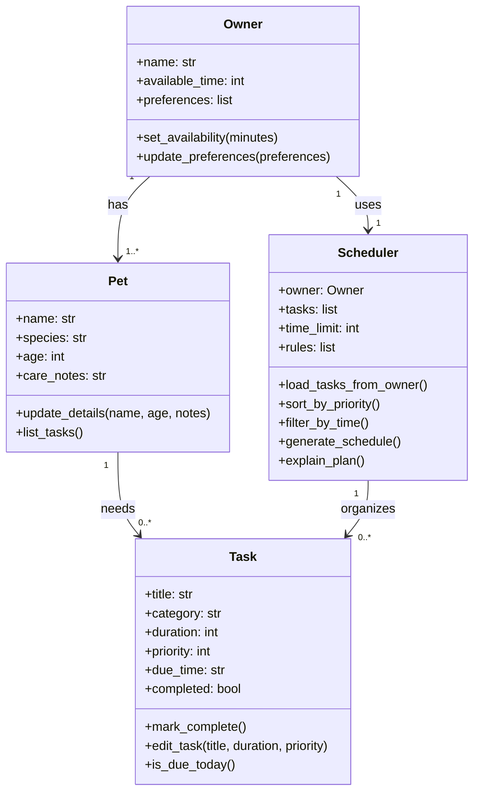

# PawPal+ Project Reflection

## 1. System Design

**a. Initial design**

- My initial design focused on four main classes: `Owner`, `Pet`, `Task`, and `Scheduler`. I chose these classes because they match the main responsibilities of the app: storing owner information, storing pet information, representing care tasks, and generating a daily plan.
- The `Owner` class is responsible for storing the owner's name, available time, preferences, and pet list. It also handles updates to availability and preferences so the scheduler has the right constraints to work with.
- The `Pet` class is responsible for storing information about each pet, including its name, species, age, care notes, and assigned tasks. It also provides methods for updating pet details and viewing that pet's tasks.
- The `Task` class is responsible for representing individual care activities such as walks, feedings, or medications. It stores important scheduling details like category, duration, priority, due time, and completion status, and it supports actions such as editing the task, marking it complete, and checking whether it belongs in today's schedule.
- The `Scheduler` class is responsible for organizing tasks into a daily plan. It uses owner constraints and task information to sort tasks by priority, filter tasks that fit within the available time, and generate an explanation for the final plan.

- I kept the relationships simple so they match the app requirements: an owner can have pets, pets can have care tasks, and the scheduler organizes tasks into a daily plan.
- I treated the daily schedule as the output produced by the `Scheduler` instead of making it a separate class in the UML.

**b. Design changes**

- Yes. After reviewing the class skeleton, I updated the `Scheduler` design so it can hold a reference to an `Owner` and load tasks from that owner's pets.
- I made this change because the earlier version treated tasks as a separate input list, which could duplicate data already stored inside each `Pet`. Linking the scheduler more directly to the owner-pet-task relationship makes the design cleaner and should make the scheduling logic easier to manage later.

---

## 2. Scheduling Logic and Tradeoffs

**a. Constraints and priorities**

- What constraints does your scheduler consider (for example: time, priority, preferences)?
- How did you decide which constraints mattered most?

**b. Tradeoffs**

- Describe one tradeoff your scheduler makes.
- Why is that tradeoff reasonable for this scenario?

---

## 3. AI Collaboration

**a. How you used AI**

- How did you use AI tools during this project (for example: design brainstorming, debugging, refactoring)?
- What kinds of prompts or questions were most helpful?

**b. Judgment and verification**

- Describe one moment where you did not accept an AI suggestion as-is.
- How did you evaluate or verify what the AI suggested?

---

## 4. Testing and Verification

**a. What you tested**

- What behaviors did you test?
- Why were these tests important?

**b. Confidence**

- How confident are you that your scheduler works correctly?
- What edge cases would you test next if you had more time?

---

## 5. Reflection

**a. What went well**

- What part of this project are you most satisfied with?

**b. What you would improve**

- If you had another iteration, what would you improve or redesign?

**c. Key takeaway**

- What is one important thing you learned about designing systems or working with AI on this project?
